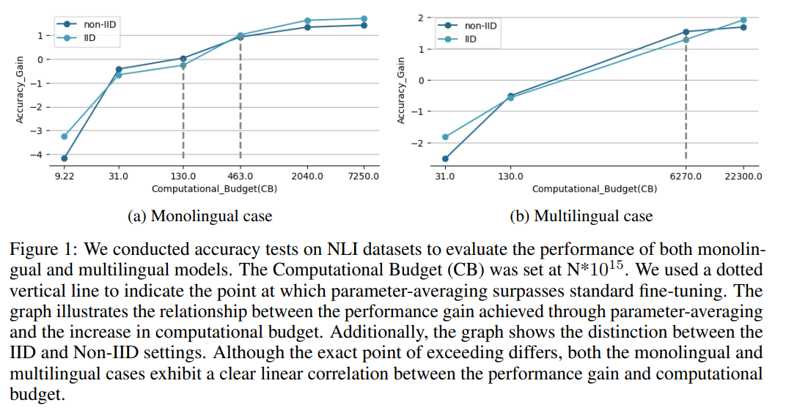

# Parameter Averaging Laws for Multitask Language Models

[Neurips 2023 FL workshop] This is the official codebase of **[Parameter Averaging Laws for Multitask Language Models] (https://openreview.net/forum?id=qQ2qXFu05s)**. The repository provides the code of our main experiment. 

Short Description of Paper: Parameter-averaging, a method for merging multiple models, has shown promise in improving performance without needing extra space or retraining. However, the conditions for its success are not yet well-defined. This study empirically examines key factors, such as computational budget, data diversity, and vocabulary size, and their role in boosting representation power and the effectiveness of parameter-averaging. Our results show that parameter-averaging enhances generalization across both in-domain and out-of-domain data. To reduce costs, we propose partial averaging, allowing selective model participation, which outperforms fine-tuning in models with strong representation. We also find that data heterogeneity becomes less impactful as representation power increases, offering insights into optimizing parameter-averaging for improved model performance.



## Requirements
### Python modules
```
pip install -r requirements.txt
```

## Example to Run
### Preprocess datasets
```
python preprocess/qasc.py
python preprocess/rte.py
```

## running standard fine-tuning code
```
python main_lm.py --data cola --model bert-large-uncased --n_cpu 1.0 --n_gpus 2 --frac_fit 1.0 --epoch 1 --batch_size 16 --batch_accum 2 --lang_mix 0.99 --centralized --n_iterations 5 --lr 1e-5 --seed 5 > ./log/bert-large/cola/central5.txt
```
## running fl code 
```
python main_lm.py --data cola --model bert-large-uncased --n_cpu 1.0 --n_gpus 2 --frac_fit 1.0 --epoch 2 --batch_size 16 --batch_accum 2 --lang_mix 0.99 --n_iterations 5 --lr 1e-5 --seed 5 > ./log/bert-large/cola/iid5.txt

python main_lm.py --data mnli --model t5-base --n_cpu 1.0 --n_gpus 2 --frac_fit 0.4 --epoch 1 --batch_size 32 --batch_accum 1 --lang_mix 0.0 --n_iterations 3 --lr 2e-5 --seed 1 > ./log/t5-base/noniid_client2_outof5_32_seed1.txt

```

## explain of each api

--data : which data you want to run

--model : which model you'll use

--n_cpu: how many cpu cores are allocated for each client

--n_gpu: how many gpus are used to run this entire code

--frac_fit: client selection ratio

--epoch: how many iterations each client run (local iteration)

--batch_size + --batch_accum: batch size of each client (batch size * batch accum = actual batch size)

--lang_mix: 0.0 for non-iid, 0.99 for iid and 0.99 --centralized for standard finetuning

--n_iteration: how many averaging happen (global epoch)

--lr: learning rate

--seed: seed

